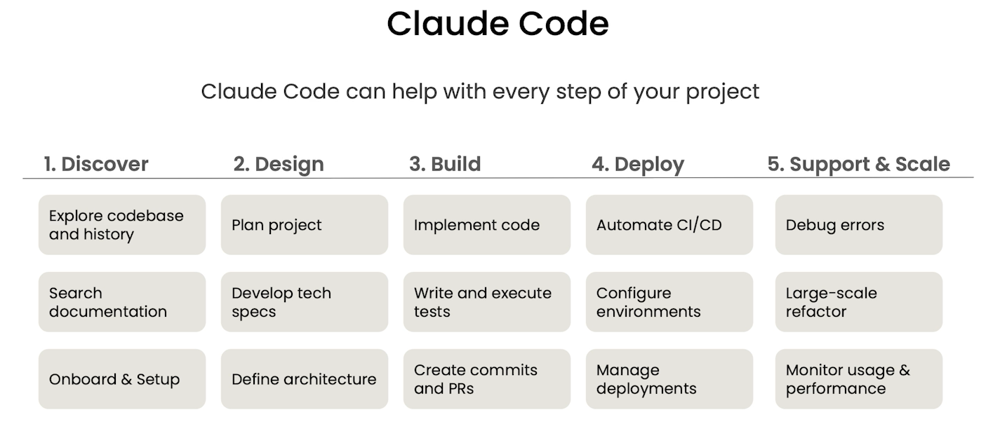
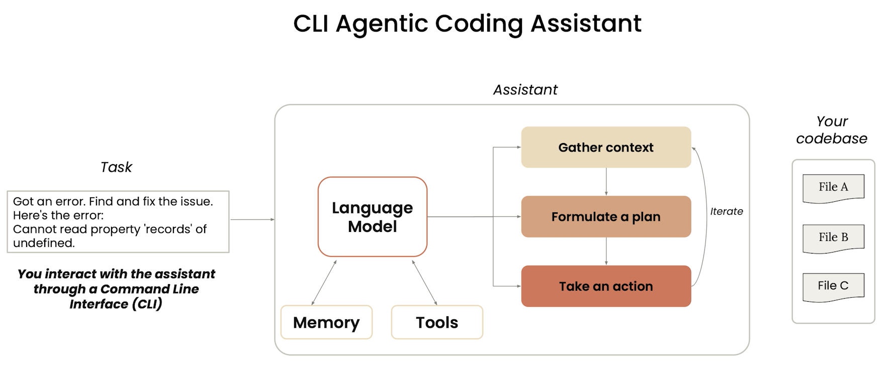
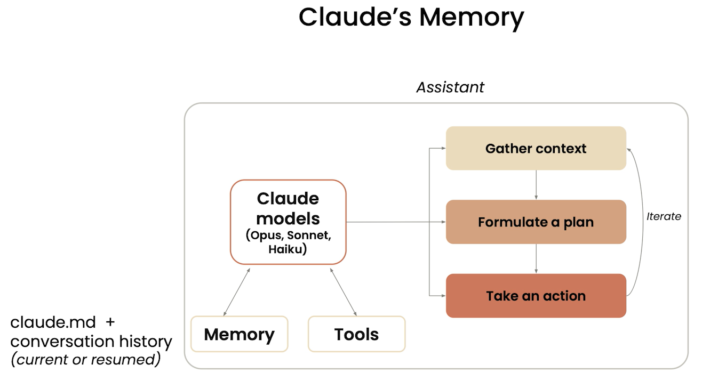
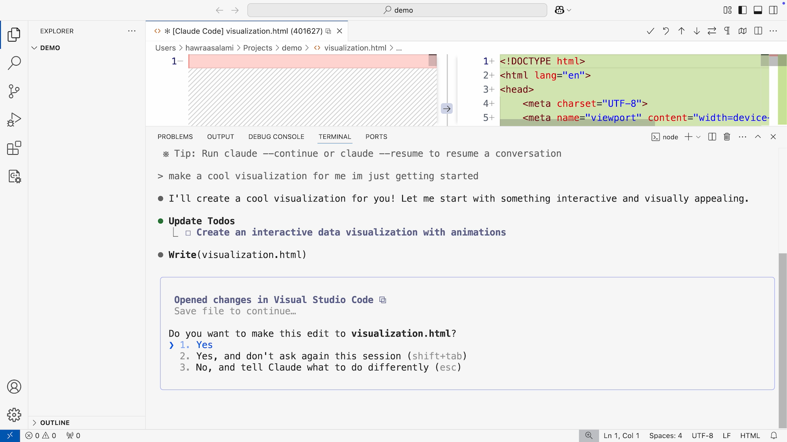
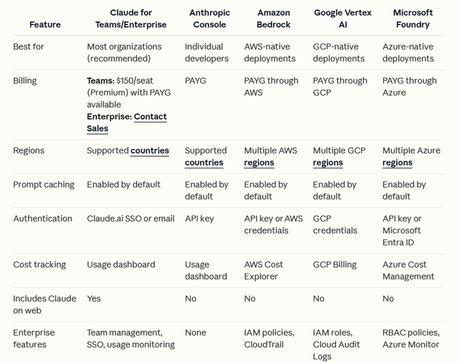

# Claude Code Introduction
## What is Claude Code

**Claude Code** is Anthropic’s developer-focused coding agent built on the Claude model family. It’s designed to operate directly inside your development workflow (CLI and editor integrations) and act as a *repository-aware, tool-using coding agent* rather than just a chat interface.

Think of it as:

> A long-context coding agent that can read your repo, plan changes, edit files, run commands, and iterate.

---

Here’s a clear, practical comparison of **Claude Code** vs **OpenAI Codex**, **GitHub Copilot**, and **Cursor** so you can see how they differ and where each shines — all backed by web-verified info. ([Claude][1])

---

## What Claude Code Actually Does

### 1️⃣ Repository-Level Understanding

Unlike basic chat assistants that only see pasted snippets, Claude Code can:

* Read entire directories
* Index large repositories
* Understand cross-file dependencies
* Track refactors across modules

This is enabled by:

* Large context windows (Claude 3.x family)
* Structured file ingestion
* Iterative reasoning passes

---

### 2️⃣ Multi-Step Code Editing

Claude Code can:

* Modify multiple files in one plan
* Generate diffs instead of rewriting full files
* Respect existing style conventions
* Refactor large codebases

Example tasks:

* “Migrate this REST service to async.”
* “Replace all legacy logging with structured logging.”
* “Extract a shared auth module.”

---

### 3️⃣ Tool Use & Command Execution

It can:

* Run shell commands
* Execute tests
* Inspect build failures
* Install dependencies
* Analyze stack traces

This moves it closer to an **agentic coding workflow**, not just a suggestion engine.

---

### 4️⃣ Debugging & Iterative Repair

Claude Code can:

* Run tests
* Observe failures
* Update code
* Re-run tests
* Repeat until passing

This loop is key for long-horizon coding tasks.

---

### 5️⃣ Planning Before Acting

It tends to:

* Propose a plan
* Wait for confirmation (optional)
* Then execute stepwise changes

This reduces destructive edits and improves safety.

---

### 6️⃣ Large-Context Reasoning

Claude models are known for:

* Strong long-context performance
* Reading large policy files
* Understanding full RFCs or API specs
* Working with long logs

This makes Claude Code strong for:

* Infrastructure refactors
* Monorepos
* Compliance-heavy codebases

---

## What Claude Code Is *Not*

It is not:

* A full autonomous IDE replacement
* A persistent background daemon (like Devin-style agents)
* A CI/CD orchestrator
* A workflow engine

It is still bounded by:

* User approval
* Session memory
* Tool constraints

---

## Where It Excels

Claude Code is particularly strong for:

* Large refactors
* Explaining legacy systems
* Security review
* Writing tests for complex systems
* Documentation generation
* Migration tasks (Python 2 → 3, SDK upgrades, etc.)

---

## Limitations

Be aware:

* Still non-deterministic
* Can hallucinate APIs
* May misunderstand complex build systems
* Not ideal for highly stateful UI-heavy projects without guidance

Like all coding agents:

> It’s powerful — but benefits from strong human oversight.

---

## Short Summary

**Claude Code is Anthropic’s repository-aware coding agent that can read, edit, run, debug, and refactor code across an entire project using multi-step reasoning and tool execution.**

If you want, I can also:

* Compare Claude Code vs OpenAI Codex-style agents
* Break down its likely internal architecture
* Evaluate it for enterprise production adoption
* Or map it to harness-based coding agent design principles

---

# How-claude-code-works

## Architectural View

Under the hood, Claude Code behaves like a **harness-based coding agent**:

* File system as memory
* Diff-based edits
* Tool execution sandbox
* Trace of reasoning steps
* Iterative improvement loop

It is not just “autocomplete”; it is a structured code agent.

---

## The agentic loop
When you give Claude a task, it works through three phases: gather context, take action, and verify results. These phases blend together. Claude uses tools throughout, whether searching files to understand your code, editing to make changes, or running tests to check its work

The agentic loop is powered by two components: models that reason and tools that act. Claude Code serves as the agentic harness around Claude: it provides the tools, context management, and execution environment that turn a language model into a capable coding agent.

### Tools 
Tools are what make Claude Code agentic. Without tools, Claude can only respond with text. With tools, Claude can act: read your code, edit files, run commands, search the web, and interact with external services. Each tool use returns information that feeds back into the loop, informing Claude’s next decision.
The built-in tools generally fall into five categories, each representing a different kind of agency.

| Category | What Claude can do |
|----------|--------------------|
| File operations | Read files, edit code, create new files, rename and reorganize |
| Search | Find files by pattern, search content with regex, explore codebases |
| Execution | Run shell commands, start servers, run tests, use git |
| Web | Search the web, fetch documentation, look up error messages |
| Code intelligence | See type errors and warnings after edits, jump to definitions, find references (requires code intelligence plugins) |
[Tools available to Claude - Claude Code][8]

Tools available to Claude
Claude Code has access to a set of powerful tools that help it understand and modify your codebase:

| Tool | Description | Permission Required |
|------|-------------|---------------------|
| AskUserQuestion | Asks multiple-choice questions to gather requirements or clarify ambiguity | No |
| Bash | Executes shell commands in your environment (see Bash tool behavior below) | Yes |
| TaskOutput | Retrieves output from a background task (bash shell or subagent) | No |
| Edit | Makes targeted edits to specific files | Yes |
| ExitPlanMode | Prompts the user to exit plan mode and start coding | Yes |
| Glob | Finds files based on pattern matching | No |
| Grep | Searches for patterns in file contents | No |
| KillShell | Kills a running background bash shell by its ID | No |
| MCPSearch | Searches for and loads MCP tools when tool search is enabled | No |
| NotebookEdit | Modifies Jupyter notebook cells | Yes |
| Read | Reads the contents of files | No |
| Skill | Executes a skill within the main conversation | Yes |
| Task | Runs a sub-agent to handle complex, multi-step tasks | No |
| TaskCreate | Creates a new task in the task list | No |
| TaskGet | Retrieves full details for a specific task | No |
| TaskList | Lists all tasks with their current status | No |
| TaskUpdate | Updates task status, dependencies, details, or deletes tasks | No |
| WebFetch | Fetches content from a specified URL | Yes |
| WebSearch | Performs web searches with domain filtering | Yes |
| Write | Creates or overwrites files | Yes |
| LSP | Code intelligence via language servers. Reports type errors and warnings automatically after file edits. Also supports navigation operations: jump to definitions, find references, get type info, list symbols, find implementations, trace call hierarchies. Requires a code intelligence plugin and its language server binary | No |
---

### Claude Code Memory: How It Works

Claude Code's memory is built on a **hierarchical system of Markdown files** that are loaded into context at the start of each session — essentially giving Claude persistent knowledge across sessions.

### The Memory Types (Hierarchy)

**1. Global / Personal Memory**
`~/.claude/CLAUDE.md` stores your personal preferences that follow you across all projects — things like your preferred coding style, communication preferences, languages you use, etc.

**2. Project Memory**
`./CLAUDE.md` lives in your repository root and gets committed to version control. This is your team's shared brain — architectural decisions, coding conventions, API patterns, and anything that should be consistent across the team.

**3. Local Project Memory**
`./CLAUDE.local.md` is your personal workspace notes for a project — maybe a specific sandbox URL or personal debugging strategies. It's automatically added to `.gitignore`, so it stays private and never gets committed.

**4. Auto Memory**
Auto memory is a persistent directory where Claude records learnings, patterns, and insights as it works. It automatically captures things Claude discovers during a session. Only the first 200 lines of its main `MEMORY.md` file are loaded.

---

### How Files Are Loaded

CLAUDE.md files in the directory hierarchy above the working directory are loaded in full at launch. CLAUDE.md files in child directories load on demand when Claude reads files in those directories. More specific instructions take precedence over broader ones.

---

### Key Features

**`@import` syntax** — CLAUDE.md files can import additional files using `@path/to/import` syntax, allowing you to reference things like your README or package.json without duplicating content.

**Modular rules** — You can place topic-specific or path-specific rules in `.claude/rules/` subdirectories to keep the root CLAUDE.md small and clean.

**`/memory` command** — You can edit existing memories with the `/memory` command, including ones saved in project-level and user-level CLAUDE.md files.

**`#` shortcut** — You can quickly add something to your CLAUDE.md mid-session using the `#` key in Claude Code.

**Disable auto memory** — You can override all memory settings with the `CLAUDE_CODE_DISABLE_AUTO_MEMORY` environment variable, which is useful for CI or managed environments.

---

### Why It Matters

Without memory files, Claude forgets everything between sessions — your coding preferences, project conventions, corrections you've made. The most successful teams treat Claude's memory files as living documentation — not just for the AI, but for the entire development team. They've become a new form of architectural decision records, constantly evolving with the codebase they describe.

In short: **Claude Code memory = Markdown files that act as persistent context**, loaded hierarchically so Claude always knows your preferences, your project's rules, and lessons learned from past sessions.

# Demo

# Deployment

([Claude-compare dempoyment options][1])

# Code Tools Comparison

## What These Tools *Are*

| Tool               | What it *fundamentally is*                                                                                                                                                              |
| ------------------ | --------------------------------------------------------------------------------------------------------------------------------------------------------------------------------------- |
| **Claude Code**    | AI coding agent that *operates as an agent* in your terminal/IDE — it reads your codebase, edits files, runs commands, runs tests, and automates entire coding workflows. ([Claude][1]) |
| **OpenAI Codex**   | LLM trained for code generation; powers code writing and agent tasks (can be used as cloud agent). ([OpenAI][2])                                                                        |
| **GitHub Copilot** | AI pair programmer integrated into IDEs with real-time suggestions and (in newer modes) *agent-like task execution*. ([维基百科][3])                                                        |
| **Cursor**         | AI-enhanced **IDE (fork of VS Code)** with deep project understanding, multi-file refactors, and smart edits. ([维基百科][4])                                                               |

---

## Comparison Table (Claude Code vs Codex vs Copilot vs Cursor)

| **Aspect**                        | **Claude Code**                                                            | **OpenAI Codex**                                           | **GitHub Copilot**                                      | **Cursor**                                          |
| --------------------------------- | -------------------------------------------------------------------------- | ---------------------------------------------------------- | ------------------------------------------------------- | --------------------------------------------------- |
| **Type**                          | *Agentic coding tool* (CLI + IDE + agent workflows)                        | *LLM code generator*                                       | *IDE code assistant / autocomplete*                     | *AI-enhanced coding IDE*                            |
| **Main Focus**                    | Full workflow automation: read, modify, test, commit, PR                   | Code generation from prompts, multi-task agent tasks       | Inline completion & suggestions                         | Real-time intelligent coding inside editor          |
| **Context Awareness**             | Reads full repo, dependencies, project context automatically ([Claude][1]) | Limited by model prompt/context                            | Integrated with IDE file but not full project semantics | Indexes project for refactor & rewrites ([维基百科][4]) |
| **Multi-File/Repo Changes**       | Yes — can plan & apply multi-file changes ([Claude API Docs][5])           | Yes (via API workflows but less seamless) ([OpenAI][2])    | Yes (via Copilot Chat / agent mode) ([维基百科][3])         | Yes — based on editor + AI logic ([维基百科][4])        |
| **Execution of Commands/Tests**   | Yes — can run tests, execute shell commands ([Claude API Docs][5])         | Not natively — needs custom tool integration ([OpenAI][2]) | Limited; mostly code suggestion, not automation         | Not a task executor (editor-centric)                |
| **Autonomy Level**                | *High* — agent can work until task completion ([Reddit][6])                | *Medium* — depends on integration                          | *Low*–*Medium* (recent agent modes) ([维基百科][3])         | *Low* (interactive)                                 |
| **IDE Integration**               | Terminal / VS Code / JetBrains ([Claude][1])                               | Via API or extensions                                      | Deep IDE integration (VS Code, JetBrains) ([维基百科][3])   | Built-in editor (fork of VS Code) ([维基百科][4])       |
| **Autonomous Workflows (Agents)** | Yes — CLI native agent workflows                                           | Possible with custom orchestration                         | Emerging via Copilot agent modes ([维基百科][3])            | No                                                  |
| **User Control (approval)**       | Explicit approval before file changes ([Claude API Docs][5])               | Depends on implementation                                  | Copilot *suggests*, user accepts                        | Real-time control                                   |
| **Best Use Case**                 | Large tasks (refactor, bug fix, PR automation)                             | Building custom code tools                                 | Interactive coding support                              | Live developer editing + context                    |
| **Typical UX**                    | Terminal or editor commands                                                | API responses                                              | In-IDE suggestions / chat                               | Editor UI with AI enhancements                      |

---

## Key Differences Explained

### **Claude Code — Agentic Workflow**

* Acts like a *coding agent* — not just text generation.
* Reads whole codebase, understands dependencies, can run commands and tests. ([Claude API Docs][5])
* Works where you work: terminal, IDE, Slack, etc. ([Claude][1])
* Designed for *large, multi-file tasks* and autonomous code changes.

**Summary:** *Code automation agent* — beyond simple suggestions.

---

### **OpenAI Codex — Foundational Model**

* Large language model specialized in generating code. ([OpenAI][2])
* Can be embedded in your own tools (CLIs, editors, agents).
* Not a standalone “product”; more like a *building block*.

**Summary:** *LLM engine* for code, not a full coding product.

---

### **GitHub Copilot — Pair Programmer**

* Works inside IDEs (VS Code, JetBrains) giving live suggestions. ([维基百科][3])
* Can generate small code snippets or larger blocks as you type.
* Newer “agent/assist” modes try to automate tasks inside IDE.

**Summary:** *Interactive suggestions inside editor.*

---

### **Cursor — AI Editor**

* Advanced AI editor (fork of VS Code) that deeply understands context. ([维基百科][4])
* Great for *multi-file refactoring* and *project-wide context*.

**Summary:** *AI-powered coding environment* focused on realtime editing.

---

##  Rough Categorization

| Category                    | Examples               |
| --------------------------- | ---------------------- |
| **LLM core model**          | OpenAI Codex           |
| **In-IDE coding assistant** | GitHub Copilot, Cursor |
| **Agentic coding agent**    | Claude Code            |

---

##  When to Use What

* **Daily development + inline help →** GitHub Copilot
* **Deep project edits + refactors →** Cursor or Claude Code
* **Automated workflows (end-to-end code tasks) →** Claude Code
* **Custom coding tools backend →** OpenAI Codex (as component)

---

###  Summary

* **Claude Code** isn’t just an IDE plugin — it’s an *agentic coding assistant* that can read a project, plan, edit, run tests, and produce commits autonomously. ([Claude API Docs][5])
* **OpenAI Codex** is the *model* that powers many code generation workflows. ([OpenAI][2])
* **GitHub Copilot** is your *AI pair programmer* inside IDEs. ([维基百科][3])
* **Cursor** is an *AI-enhanced editor* with deeper codebase semantics. ([维基百科][4])

---

If you want, I can also build a **feature roadmap matrix** showing when to choose each tool based on task complexity (e.g., bug fix vs full feature implementation).

# References
[1]: https://claude.com/product/claude-code?utm_source=chatgpt.com "Claude Code by Anthropic | AI Coding Agent, Terminal, IDE"
[2]: https://openai.com/index/introducing-codex/?utm_source=chatgpt.com "Introducing Codex"
[3]: https://en.wikipedia.org/wiki/GitHub_Copilot?utm_source=chatgpt.com "GitHub Copilot"
[4]: https://en.wikipedia.org/wiki/Cursor_%28code_editor%29?utm_source=chatgpt.com "Cursor (code editor)"
[5]: https://docs.anthropic.com/en/docs/claude-code/overview?utm_source=chatgpt.com "Claude Code overview - Anthropic"
[6]: https://www.reddit.com/r/ClaudeCode/comments/1r3anr1/the_real_difference_between_claude_code_codex_and/?utm_source=chatgpt.com "The real difference between Claude Code, Codex, and Copilot: continuous execution"
[7]: https://code.claude.com/docs/en/third-party-integrations "Third-party integrations - Claude Code"
[8]: https://code.claude.com/docs/en/settings#tools-available-to-claude "Tools available to Claude - Claude Code"
[9]: https://learn.deeplearning.ai/courses/claude-code-a-highly-agentic-coding-assistant/lesson/66b35/introduction "Introduction - Claude Code: A highly agentic coding assistant"