Here's a clear breakdown of **Claude Cowork** and how it relates to **Claude Code**:
# Reference
[1]: https://claude.com/blog/cowork-research-preview "Cowork: Claude Code for the rest of your work"
[2]: https://support.claude.com/en/articles/13345190-get-started-with-cowork "Get Started with Cowork"
[3]: https://claude.com/plugins#plugins "Claude Plugins"
[4]: https://claude.com/blog/cowork-plugins-finance "Cowork: Finance Plugin"
[5]: https://github.com/anthropics/financial-services-plugins "GitHub: Anthropics/financial-services-plugins"
[6]: https://help.apiyi.com/en/claude-cowork-deep-dive-open-source-alternative-guide-en.html "Understand Claude Cowork in 3 Minutes"

#  Claude Cowork Introduction
---

## What is Claude Cowork?
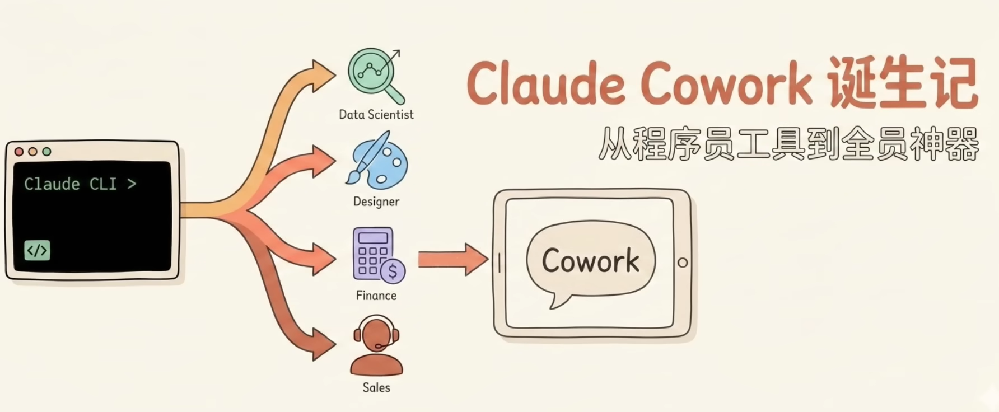

When Anthropic released Claude Code, they expected developers to use it for coding — and they did. But users quickly began using it for almost everything else. This prompted Anthropic to build Cowork: a simpler way for anyone — not just developers — to work with Claude in the very same way.

In short, **Cowork is Claude Code's agentic approach, extended to all knowledge workers** — not just engineers.

[Cowork: Claude Code for the rest of your work][1]

---

## Status

Cowork is available on all paid plans for Windows and macOS. Claude Max subscribers can try Cowork now by downloading the macOS app, then clicking on "Cowork" in the sidebar. If you're on another plan, you can join the waitlist for future access.

It's currently still in **research preview**, with agent safety features still being developed. 

---

## Key capabilities
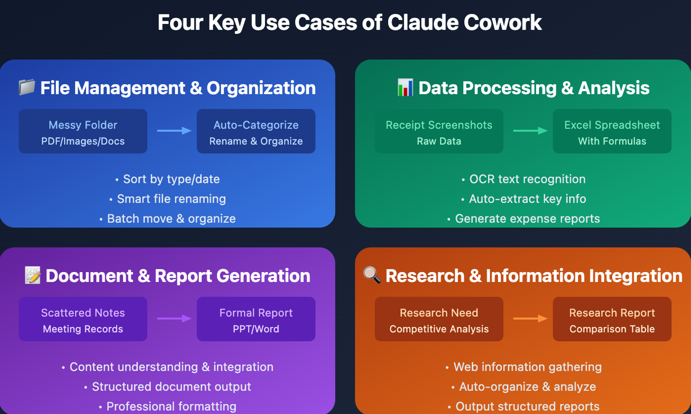

- **File Access:** In Cowork, you give Claude access to a folder of your choosing on your computer. Claude can then read, edit, or create files in that folder. It can re-organize your downloads, create a new spreadsheet from screenshots, or produce a draft report from scattered notes.

- **Sub-agent coordination**: Claude breaks complex work into smaller tasks and coordinates parallel workstreams to complete them.

- **Long-running tasks**: Work on complex tasks for extended periods without conversation timeouts or context limits interrupting your progress.

- **Privacy & Safety:** Cowork runs locally in an isolated virtual machine (VM) on your computer. You choose which folders and connectors Claude can see, and it can't access anything without your explicit permission. Before taking significant actions, Claude shows you what it plans to do and waits for your approval. Cowork conversation history is stored locally on your device, not on Anthropic's servers.

- **Plugins:** The plugins bundle skills, connectors, slash commands, and sub-agents so people can use Cowork as a specialist for specific roles, teams, and companies.

- **Enterprise Integrations:** Organizations can connect Claude Cowork to their existing tools like Google Drive, Gmail, DocuSign, and FactSet. They can also deploy customizable plugins across domains like financial analysis, engineering, and human resources.

---

## How Does It Work?

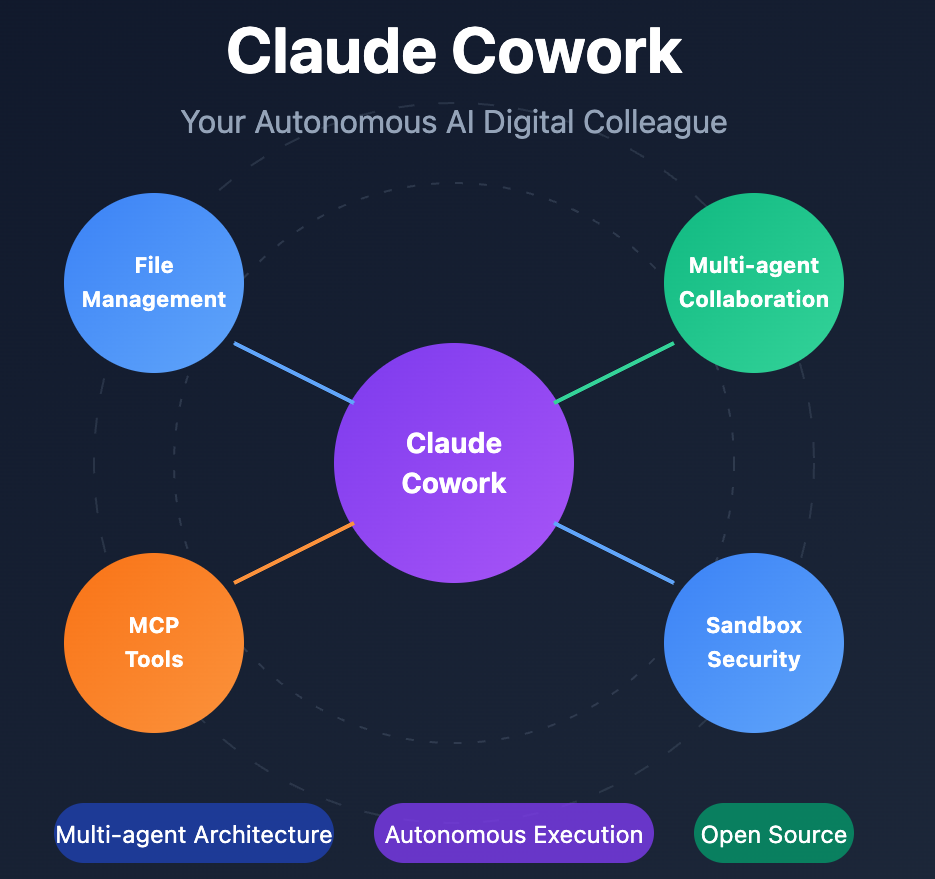

Cowork runs directly on your computer, giving Claude access to the files you choose to share. Code runs safely in an isolated space, but Claude can make real changes to your files.

When you start a task in Cowork, Claude:

1. Analyzes your request and creates a plan.
2. Breaks complex work into subtasks when needed.
3. Executes work in a virtual machine (VM) environment.
4. Coordinates multiple workstreams in parallel if appropriate.
5. Delivers finished outputs directly to your file system.

You maintain visibility into what Claude is planning and doing throughout the process so you can steer when it matters, or let Claude run independently.

---

## Architecture

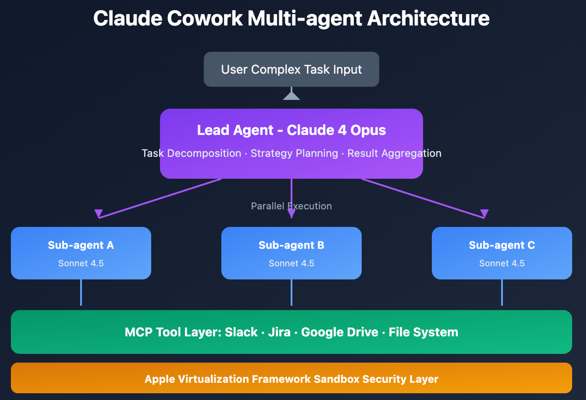

## Plugins
[Claude Plugins][3]

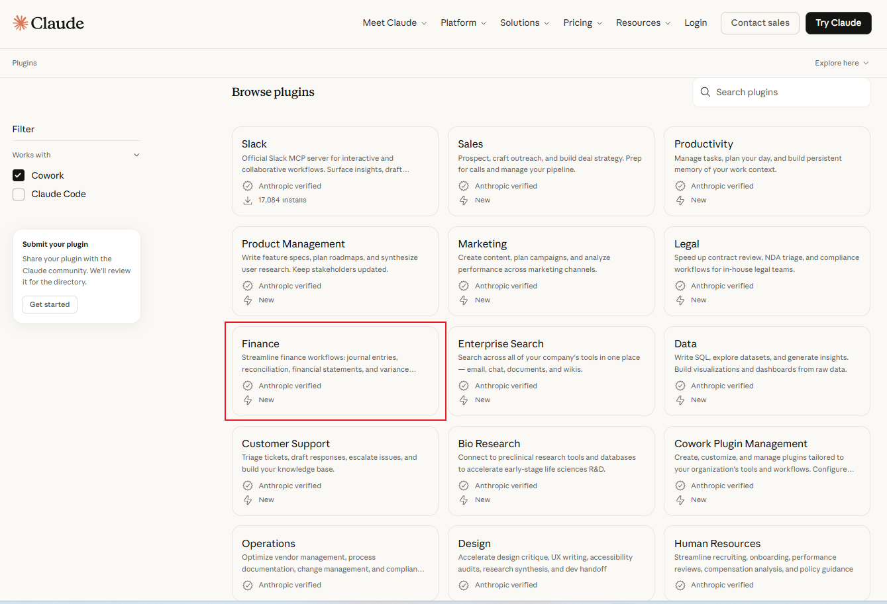
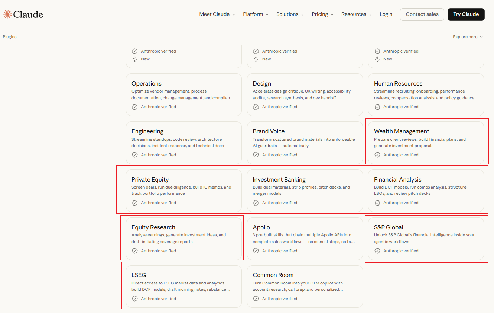

## Cowork vs. Claude Code — The Relationship

| | **Claude Code** | **Claude Cowork** |
|---|---|---|
| **Target user** | Developers / engineers | All knowledge workers |
| **Primary focus** | Coding, software tasks | File management, documents, business workflows |
| **Interface** | Command line (terminal) | Desktop app (macOS & Windows) |
| **Agentic?** | Yes | Yes (same underlying approach) |

Anthropic is looking to build on the momentum of its existing products like Claude Code — its AI coding tool that has seen a wave of adoption across companies over the last year. "Engineers think about Claude Code as a tool that they just couldn't live without anymore," said Kate Jensen, Head of Americas at Anthropic. "We expect that every knowledge worker will feel that way about Cowork."

---

## Impacts

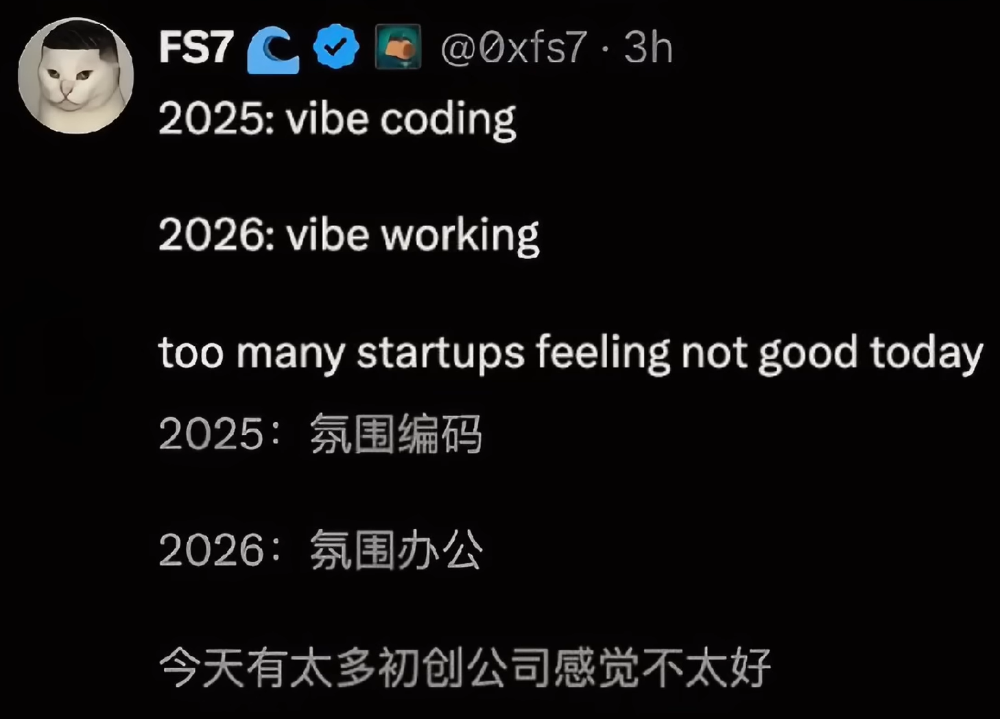

# Claude Usecases

## Use Case 1: File Management
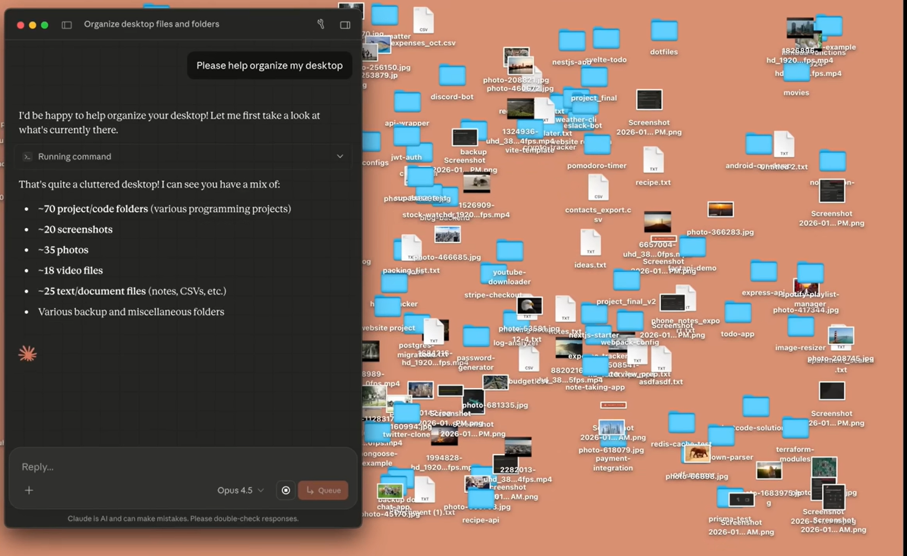
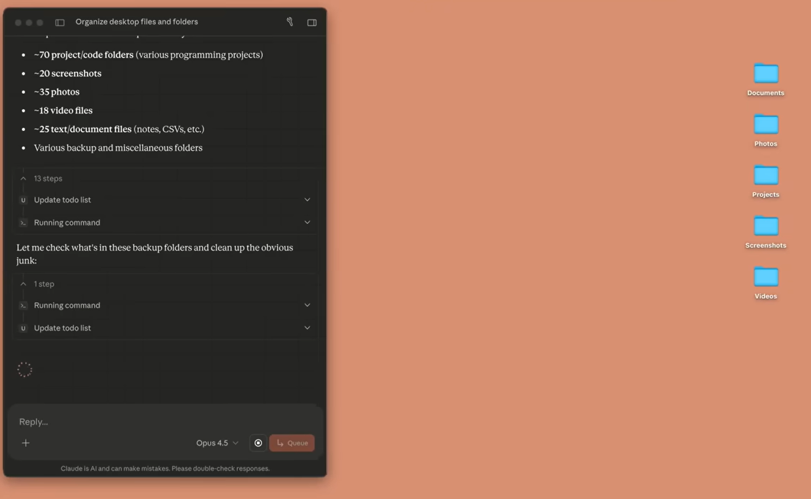

## Use Case 2: Generate Lease Review Report
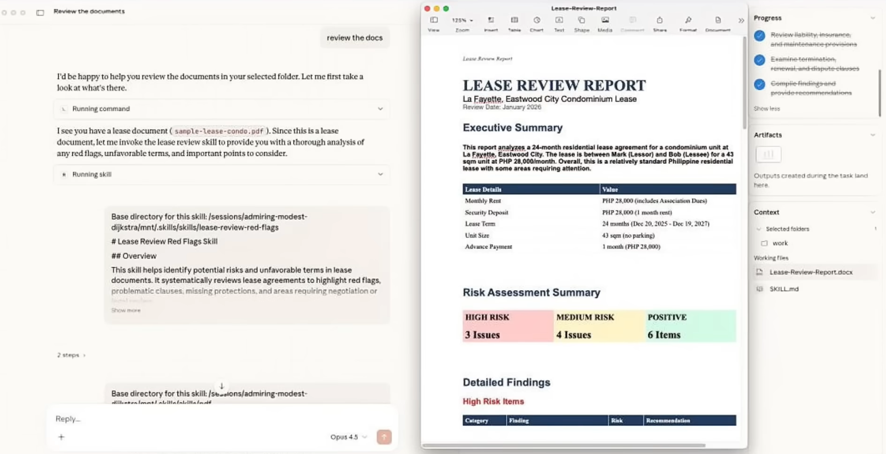
<!-- 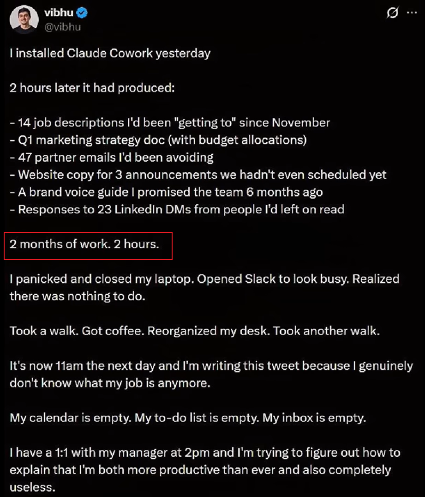 -->

<!--  -->

