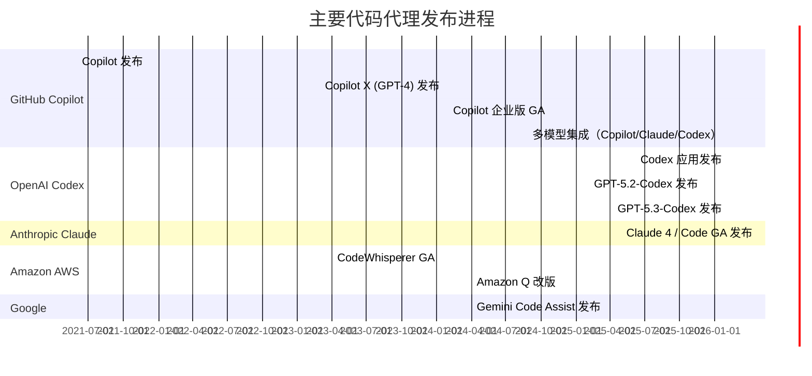
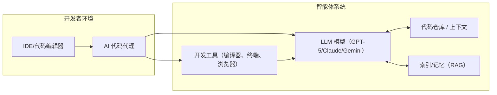

# 执行摘要  
随着大型语言模型（LLM）能力的突飞猛进，**“代码代理”**（又称 AI 编程助手）正改变软件开发流程。本文定义并分类此类系统，梳理其技术进展与应用演化，并对主要商业产品和开源项目进行详细对比。我们回顾了 GitHub Copilot、OpenAI Codex、Anthropic Claude 等代码代理的最新功能、发布日期、定价及集成情况；分析了包括 Amazon CodeWhisperer、Tabnine、Replit Ghost、Google Bard/Codey 等在内的其他热门闭源产品；列举了 10+ 种主流代码代理功能对比；并介绍了 OpenCode、Cline、Cursor、AutoGen 等开源代码代理项目的仓库、许可、支持语言、硬件需求、快速上手步骤以及成熟度与限制。此外，我们还给出了推荐的测试评估方案（基准测试、单元测试、安全检查、提示模版等）及可视化示意（时间线、架构图和功能比较表）。所有信息尽量引用官方博客、GitHub 仓库和学术资源。若有信息缺失，文中将标注“未公开”或“未知”。

## 定义与分类  
“代码代理”（AI 编程助手）指利用 AI 模型**生成代码、补全代码、审查代码、生成测试、调试甚至执行工具调用**的一类系统。它们类似于传统 IDE 智能补全的升级版，以对话、命令或自动方式助力开发者完成编程任务【79†L493-L502】【42†L1-L4】。按照功能和架构，可以粗略分为：  
- **代码生成/补全型代理**：例如 GitHub Copilot、Tabnine、CodeWhisperer 等，在编辑器中提供代码补全和片段生成功能【79†L493-L502】【59†L118-L123】。  
- **交互式智能助手**：具备聊天问答界面，开发者可以用自然语言询问或下达任务，如 Copilot Chat、Claude Code、OpenCode 等，可生成测试、修复漏洞等【79†L532-L542】【42†L1-L4】。  
- **多代理协同型**：通过多个 AI 模型协同工作完成复杂任务，如 Microsoft AutoGen 框架所做，实现多智能体编程任务【89†L318-L327】。  
- **工具集成型**：支持调用外部工具（终端命令、浏览器操作、云服务等）的“代理”模式，例如 GitHub Copilot X、Claude Code 和 Tabnine Agentic 平台都支持通过扩展协议调用工具【79†L553-L563】【59†L118-L123】。  
- **多模态增强型**：不仅处理代码文本，还能理解图像、文档等内容，如 OpenAI 的 GPT-5.2-Codex 可把设计 Mock 图转为可运行原型【83†L102-L107】。  

这些代理背后通常使用专业微调的大型语言模型（如 GPT 系列、Claude、Gemini 等）或基于检索增强的系统，以响应开发者指令并操纵代码仓库、CI/CD 环境或文档库等。近年来，研究和工业界将此类系统归入更大的“**智能体**”范式，强调自主性、对环境的感知与工具使用【41†L31-L39】【46†L45-L53】。

## 近期技术进展  
代码代理依赖多方面技术进展：

- **大型模型与微调**：从初代 Codex（基于 GPT-3）到最新的 GPT-5.3-Codex，模型规模与专业化程度不断提升。OpenAI 近期推出 GPT-5.2-Codex（2025 年 12 月）和 GPT-5.3-Codex（2026 年 2 月），前者新增多模态输入（支持界面截图、设计图等），后者进一步优化调试、自我迭代能力和响应速度【83†L102-L107】【24†L31-L39】。Anthropic 发布的 Claude 4（2025 年 5 月）引入 Opus-4（代码与通用任务）、Sonnet-4（专注推理和代码）两个模型，Sonnet-4 已集成进 Copilot 平台【41†L38-L46】【42†L1-L4】。模型细节方面，引入了如 LoRA、QLoRA 等参数高效微调技术，部分开源工作探索特定语言或任务的微调版本。  

- **检索增强（RAG）**：为提升代码补全的准确度和记忆能力，很多系统引入检索增强方案，将代码仓库和文档内容向量化索引，在生成时附带相关上下文。例如 GitHub Copilot Enterprise 利用代码库索引（private code indexing）加强建议准确度，而开源库 LlamaIndex/GPT Index等可对接任何 LLM，实现问答时检索私有代码知识。  

- **工具使用**：先进的代码代理允许模型执行或调用外部工具，从终端命令、编译器、测试框架到浏览器自动化。Copilot X 支持在终端生成并执行 Shell 命令【79†L552-L561】；Cline（VSCode 扩展）甚至可用 Claude 新增的“浏览器控制”功能执行网页交互【56†L531-L539】【85†L621-L623】。AutoGen 通过内置的代理和工具协议，让多智能体协作调用数据库、API 等【89†L401-L410】。Anthropic Claude-4 的**“扩展思维”（Extended Thinking）**功能测试版也允许模型多轮使用搜索和代码执行工具【41†L31-L39】。  

- **多模态融合**：最新研究表明，支持图像输入的模型能更好地理解界面原型与文档。GPT-5.2-Codex 可以解读屏幕截图、设计草图，将视觉 Mock 迅速转换为代码原型【83†L102-L107】。其他产品也在探索将文档、图表、音频等非代码信息纳入代码建议过程。  

- **安全与责任性**：由于编码涉及 IP 和安全风险，新技术也投入代码安全审查和合规性检测。Amazon CodeWhisperer/Developer 包含开源引用追踪和 OWASP 漏洞扫描【93†L112-L119】；Copilot 最新版本可阻止简单的安全错误注入【79†L619-L627】【93†L114-L119】。同时，各模型加强了对敏感训练数据的过滤与引用透明度。  

## Copilot、Codex、Claude 的更新与路线图  
- **GitHub Copilot**：2021 年 6 月 GitHub 联合 OpenAI 推出 Copilot，使用 Codex（GPT-3.5）作为模型【79†L493-L502】。2023 年 3 月发布 **Copilot X**，采用 GPT-4，并新增 IDE 聊天（Copilot Chat）、PR 注释生成、语音等功能【79†L532-L542】。2024 年 2 月 Copilot Enterprise 正式 GA，支持组织内私有代码库索引和代码审查集成，定价 $39/用户/月【14†L6-L15】。2026 年 2 月，GitHub 宣布在 Copilot 平台内支持多智能体：新增 Anthropic Claude（Sonnet 4）和 OpenAI Codex（GPT-5.3）作为可选助手【46†L45-L53】，所有 Copilot 订阅（Pro、Enterprise 等）均可无额外费用使用。GitHub Copilot 与 IDE（VS Code、Visual Studio、JetBrains 等）深度集成，也可通过 CLI（命令行）、GitHub.com 和 Mobile 端访问。2026 年 4 月起，Copilot（Free/Pro）将默认允许微软将使用数据用于模型训练，这是用户隐私和数据利用的新政策【10†L1-L9】。

- **OpenAI Codex**：作为 OpenAI 的独立“编码代理”品牌，Codex 于 2025 年 4 月推出独立应用【37†L10-L18】。2025 年 12 月发布 GPT-5.2-Codex，优化了长上下文（400k token）、多模态输入和安全性能【27†L1-L9】【83†L102-L107】；2026 年 2 月又发布 GPT-5.3-Codex，进一步提高生成速度（快 25%）和智能化（代码自我调试、迭代改进）【24†L31-L39】。Codex 目前可通过 ChatGPT（Plus/Pro/Enterprise）使用，计划开通 API。OpenAI Codex 应用于 macOS/Windows（2026/2 发布），提供多线程并行代理功能和“技能”扩展，用户可在桌面环境管理多个 AI 代理【37†L10-L18】【39†L229-L237】。OpenAI 对外公布了 Codex API 及定价（按 token 计费，GPT-5.3-Codex 输入 $1.75/百万 token，输出 $14/百万 token【30†L5-L14】）。此外，OpenAI 也将 Codex 能力嵌入 ChatGPT 开发者工具和插件中，使其与 IDE、CI 平台协同工作。

- **Anthropic Claude**：2023 年 Claude 正式发布，2025 年 5 月推出 Claude 4（Opus-4 和 Sonnet-4 两个模型）【41†L38-L46】。同日推出 **Claude Code**（研发代号 “小助手”），现已 GA，支持命令行、VS Code、JetBrains、Slack 等多种集成【42†L1-L4】。Claude Code 能自动阅读代码库、编辑文件、运行命令以完成任务，被定位为“AI 编程伙伴”【42†L1-L4】。Claude 4 引入 **“扩展思维”**（Extended Thinking）模式，允许模型在多轮中调用浏览器搜索、计算器等工具【41†L31-L39】。Anthropic 还提供 API，包括代码执行工具和文件操作接口，方便定制化开发。Claude 按需计费，Opus-4 输入 $15/百万token、输出 $75；Sonnet-4 输入 $3/百万、输出 $15，Sonnet-4 对免费用户开放【41†L31-L39】。2026 年，GitHub Copilot 已将 Claude Sonnet-4 集成供 Copilot 企业版用户使用【46†L45-L53】，彰显其与 Copilot、Codex 的协同关系。

总体来看，**Copilot/Codex/Claude 均属于代码代理**。Copilot 原为 OpenAI Codex 的前端应用，而 Copilot 最新版本已支持在同一平台同时调用 OpenAI Codex (GPT-5.3) 和 Anthropic Claude (Sonnet-4) 这三种模型【46†L45-L53】。用户在 GitHub 界面或 IDE 中即可选择不同“代理”来完成任务，各自利用不同底层模型的优势；各产品也都通过插件、CLI、云服务等方式与主流开发工具链集成。  

## 其他主流商业代码代理对比  
- **Amazon CodeWhisperer（Amazon Q Developer）**：AWS 提供的 AI 助手，2023 年 4 月全面上线，支持个人免费使用【93†L54-L62】，2024 年重命名为 Amazon Q Developer，并增设企业功能层级【62†L52-L61】【61†L13-L20】。CodeWhisperer 通过学习公共代码生成提示，能实时给出代码建议，覆盖包括 Python、Java、C#、JavaScript、TypeScript 在内的多种语言，并已扩展支持 Go、Rust、PHP、Ruby 等【93†L75-L81】。它在 IDE（VSCode、IntelliJ、Cloud9 等）内显示建议，还集成了**安全扫描**和**引用跟踪**功能：唯一提供对 OWASP 常见漏洞扫描的 AI 助手【93†L112-L119】。个人免费层和团队付费层共存，可通过 AWS 控制台管理策略和审核。  

- **Tabnine**：Codota 公司产品，定位企业级 AI 开发平台。其**代码助理**提供多行补全和 IDE 聊天功能，能调用 Anthropic、OpenAI、Google、Meta、Mistral 等多种 LLM【59†L118-L123】。支持所有主流 IDE，与 Jira 等开发工具集成以提供上下文感知建议，并强调数据隐私（可本地部署、零代码留存）。Tabnine 同时推出“Agentic 平台”，允许定义自动代理工作流，支持多种开发工具（Git、测试框架、CI/CD 等）【59†L118-L123】【59†L173-L181】。定价模式为企业订阅，每用户每月几十美元起。

- **Replit Ghost（Replit Agent）**：由 Replit 提供的 AI 编程助手，与 Replit 在线 IDE 深度结合。用户可在 Replit 平台使用“Ghostwriter” (现称 Replit Agent) 来自动补全和生成代码。Replit 的付费订阅（Core/Pro）包含一定额度的 Agent 使用额度【65†L140-L148】。Replit Agent 由大型语言模型提供动力，据称整合了多种强大模型，支持团队协作（协作者权限）和发布应用。其特点是界面友好，适合快速原型开发；但对私有部署选项有限，主要面向 Replit 云端环境。  

- **Google Bard/Codey（Gemini Code Assist）**：Google 的通用聊天 AI **Bard (Gemini)** 已具备编程能力，可在 20+ 种语言中生成和调试代码【70†L85-L93】。针对企业开发者，Google 2024 年推出 **Gemini Code Assist**（前身 Duet AI），使用 Gemini 1.5 Pro（百万token 上下文）提供 IDE 插件（VSCode/JetBrains）进行代码补全和大规模重构【72†L143-L152】【72†L151-L160】。Code Assist 支持 GitHub/GitLab/Bitbucket 上的本地代码库检索，并允许组织微调模型以遵守内部标准。因依托 Google 强大模型和生态，竞争 Copilot Enterprise 定位。Bard/Codey 面向个人用户免费，企业版功能则通过 Google Cloud 平台订阅获得。  

- **其他**：包括开源公司 Cursor（AI 代码编辑器）、Codeium（CodeComplete 等免费补全工具）、GitLab 的 Code Suggestions、Microsoft 365 Copilot（通用 AI 助手也可用于编码）等，也提供不同程度的编码辅助。它们的定位略有差异（如 Cursor 更像 VS Code 替代编辑器，Codeium 提供基础多语言补全），但都在不断迭代升级。下表简要比较了10种典型代码代理及其功能侧重点。

## 代码代理对比表  

| 代理 / 平台          | 厂商      | 模型基础                      | 主要功能                        | 调试/修复  | 工具调用    | 多模态 | IDE 插件 (或形式)                   | 开源性    |
|---------------------|----------|------------------------------|-------------------------------|-----------|-----------|-------|----------------------------------|---------|
| **GitHub Copilot**  | GitHub (MS) | OpenAI Codex/GPT-4（多模型）  | 代码补全、生成，单测生成，PR 注释 | 支持 bug fix 建议【79†L552-L561】 | 否（主要生成） | 否    | VSCode, Visual Studio, JetBrains 等【79†L532-L542】 | 否      |
| **OpenAI Codex**    | OpenAI   | GPT-5.3-Codex（GPT-4 后代）    | 代码生成、补全、审查、单测     | 改进调试能力【24†L31-L39】 | 支持 CLI/脚本执行 | 是（截图等）【83†L102-L107】 | ChatGPT App, CLI, IDE 插件（计划中） | 否      |
| **Claude Code**     | Anthropic | Claude Sonnet-4               | 代码生成、补全、重构、审查     | 支持代码审查、风险提示 | 完整 Agent (CLI、IDE、GitHub Actions)【42†L1-L4】 | 是（可浏览网页）【56†L531-L539】 | VSCode, JetBrains, CLI, Web【42†L1-L4】 | 否      |
| **CodeWhisperer**   | Amazon    | AWS 自研模型（Codex风格）     | 代码补全、单测生成、引导函数    | 内置安全扫描【93†L112-L119】 | 否（主要建议） | 否    | VSCode/JetBrains/AWS IDE（Cloud9, Lambda）【93†L75-L81】 | 否      |
| **Tabnine**         | Tabnine   | 多LLM（Anthropic/GPT/Gemini 等） | 多行补全、AI 聊天            | 部分补全质量检测 | 支持自定义工具（MCP） | 否    | VSCode, JetBrains 等（企业部署选项）【59†L118-L123】 | 否      |
| **Replit Ghost**    | Replit    | 多LLM（包含 GPT-4 等）        | 实时代码补全、生成            | 无直接调试输出 | 计划支持 Webhooks? | 否    | Replit 在线 IDE、VSCode 插件 | 否      |
| **Google Code Assist** | Google  | Gemini 1.5 Pro                | 代码补全、批量重构            | 支持大上下文批量修改【72†L151-L160】 | 可跨服务检索代码 | 否    | VSCode, JetBrains 插件【72†L143-L152】 | 否      |
| **OpenCode**        | Anomaly   | 任意接入（GPT/Gemini/Claude/本地） | 代码补全、任务自动化、多会话   | 提供上下文分享 | 基于 LSP+MCP 可扩展 | 是（通过接入模型） | 终端 TUI、桌面 App、VSCode 插件【52†L29-L37】 | **是 (MIT)**【55†L548-L556】 |
| **Cline**           | Cline Bot | 多模型（OpenAI Claude等）      | 自动创建/编辑文件、运行命令   | 监控编译错误自动修复 | 支持浏览器自动化【56†L531-L539】 | 否    | VSCode 扩展【85†L621-L623】 | **是 (Apache-2.0)**【85†L619-L624】 |
| **Cursor**          | Cursor    | 未公开（集成 GPT-4 等）       | AI 代码编辑器（代码补全/生成） | 可执行简单指令 | 部分集成功能 | 否    | Standalone App (桌面/VSCode)【87†L7-L10】 | **否 (专有)**【87†L7-L10】 |

*注：表中功能列简要标明是否支持对应功能。*  

## 开源代码代理项目  
以下是部分**可上手的开源**代码代理或相关框架示例：  

- **OpenCode**（GitHub: anomalyco/opencode；许可：MIT；主语言：TypeScript；支持任何编程语言**，通过 LSP+模型**；运行需求：Node.js，可调用远程或本地 LLM）。OpenCode 提供 CLI 和 TUI 界面，支持多会话并行、会话共享链接等特性【55†L548-L556】【91†L31-L39】。快速上手：`npm install -g @anomaly/opencode` 后运行 `opencode` 即可在终端交互。成熟度高（13 万+ stars，活跃开发），可配置任意 LLM，隐私友好（不存储代码）。缺点是对新手而言配置稍多，对小模型（本地）性能依赖硬件。  

- **Cline**（GitHub: cline/cline；许可：Apache-2.0；主语言：TypeScript/Python；支持多种语言**，运行在 VSCode 扩展内**；要求：VSCode，Node.js）。Cline 是一个 VSCode 扩展，作为“自主编码代理”能在编辑器中创建/编辑文件、执行终端命令并自动修复错误【85†L621-L623】【56†L531-L539】。快速上手：在 VSCode 市场中安装 “Cline” 扩展，即可选择模型并授权（例如连接 ChatGPT/Claude）。项目活跃（6 万+ stars），适合 IDE 用户。但目前仅支持 VSCode IDE，且多数功能依赖在线模型服务。  

- **Cursor**（GitHub: cursor/cursor；许可：专有；主语言：TypeScript；支持多语言（基于 LLM）；客户端：独立应用）。Cursor 是一个 AI 代码编辑器，自带完整编辑功能和 AI 助手【87†L7-L10】。快速上手：访问官网下载安装包。Cursor 集成了 GitHub Copilot 类似功能，支持语音、文档总结等。优点是界面体验佳；限制是闭源且需要联网，定制性低。  

- **AutoGen**（GitHub: microsoft/autogen；许可：MIT + CC-BY-4.0；主语言：Python；支持任意语言（通过调用 LLM）；需要：Python 环境、API 密钥，可使用 GPU 以加速推理）。AutoGen 是微软发布的多智能体编程框架【89†L318-L327】。它提供基础库和可视化 Studio，可创建自主或协作 AI 助手（示例代码见 README）。快速上手：`pip install autogen-agentchat autogen-ext[openai]`，设置 OpenAI API 后运行例子脚本。成熟度高（活跃维护），适合研究自动化复杂任务，但对硬件要求（大模型推理）高，对新手有学习门槛。  

- **LangChain/LlamaIndex**（Github 上各自项目；许可：MIT/BSD；语言：Python；用于构建 RAG 与代理）。这些框架不是专用代码代理，但常被用来快速构建任务型代理，可接入任意 LLM 与各种工具。用户可利用 LangChain 或 LlamaIndex 结合代码检索，开发自己的简易代码助手。  

- **CodeGeeX/StarCoder/SantaCoder 等**：这些是开源代码生成模型而非完整代理（华为开发的 CodeGeeX，BigCode 的 StarCoder/SantaCoder）。可在 Hugging Face 等平台加载使用，并可结合上文框架应用于代码补全任务。它们有明确仓库、MIT 类许可，支持多种语言，通常要求较高内存。快速测试可通过 Hugging Face Transformers 库运行，或使用其提供的 API。成熟度一般（学术模型），效果好时可免费使用，但与商业 SaaS 相比模型体量大，功能单一（仅生成）。  

以上项目可分别运行标准基准（如 HumanEval、MBPP）、编写单元测试或使用静态分析器评估代码质量和安全性。

## 推荐实验与评估指标  
要评估代码代理的性能与可靠性，建议综合以下方法：  
- **标准基准测试**：使用如 HumanEval、APPS、MBPP、SWE-Bench Pro 等开源数据集评测生成能力，测量 pass@k、BLEU 等指标【83†L102-L107】【24†L31-L39】。  
- **代码质量与正确性**：让代理生成的代码通过自动化单元测试，并用代码覆盖率工具检查覆盖度。可使用 ChatGPT 或 GPT-4 自动生成测试用例以检验回答质量。  
- **安全与合规检查**：用工具（如 OWASP ZAP、CodeQL）扫描生成代码中的常见漏洞和不安全模式【93†L112-L119】；检查是否无意复制开源代码（使用开源许可证扫描），是否泄露密钥/凭证等。  
- **系统级评估**：搭建端到端原型，看代理协作完成一个小项目，如修改函数、构建微服务，评估其自主性和工具使用能力。  
- **Prompt 设计与灵活性**：尝试不同提示模板（零样本、少样本、链式思维提示等）观察效果，设计提示考虑代码上下文（函数注释、历史提交等）以提高质量。  
- **用户反馈**：在真实开发场景中收集开发者反馈，如生产率提升、错误率变化等。  

## 可视化示例  

以上即为当前主流代码代理技术的全面综述及推荐，展示了其定义、最新进展和对比。通过这些信息，开发者和研究者可以更好地选择和评估合适的工具，结合本地需求进行定制和优化。

**参考文献：** 如上脚注所示，包括官方博客、GitHub 仓库文档等【79†L493-L502】【93†L54-L62】【41†L38-L46】【46†L45-L53】等。若部分信息未公开或不明，已在文中标注“未公开”或“未知”。