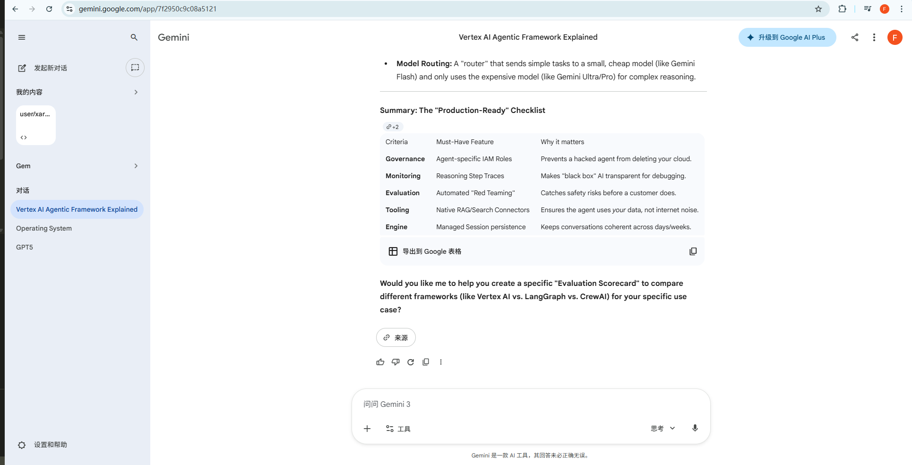
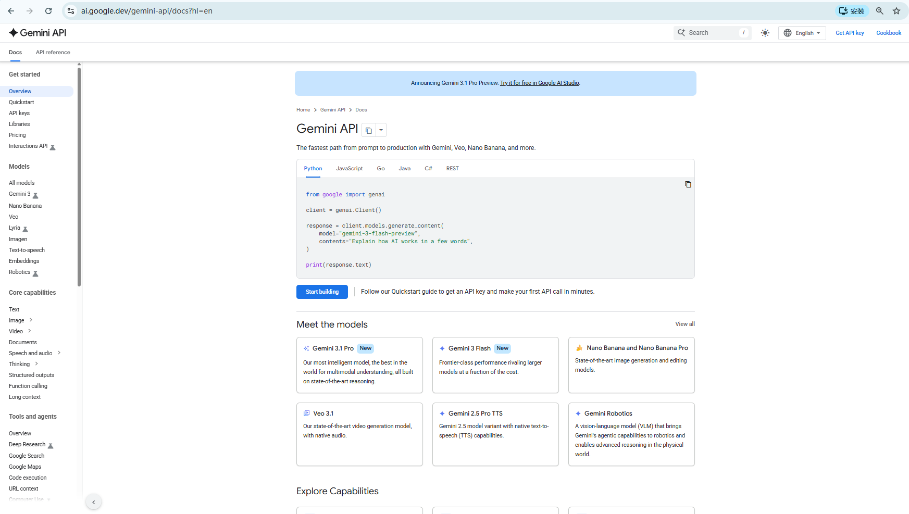
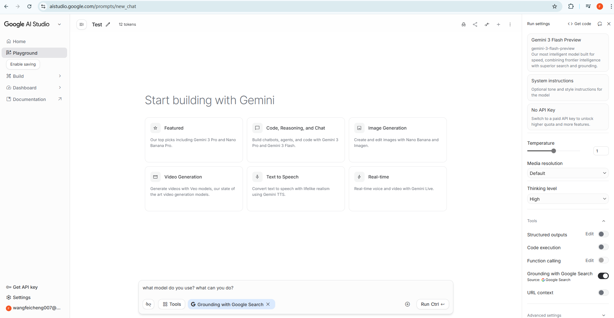
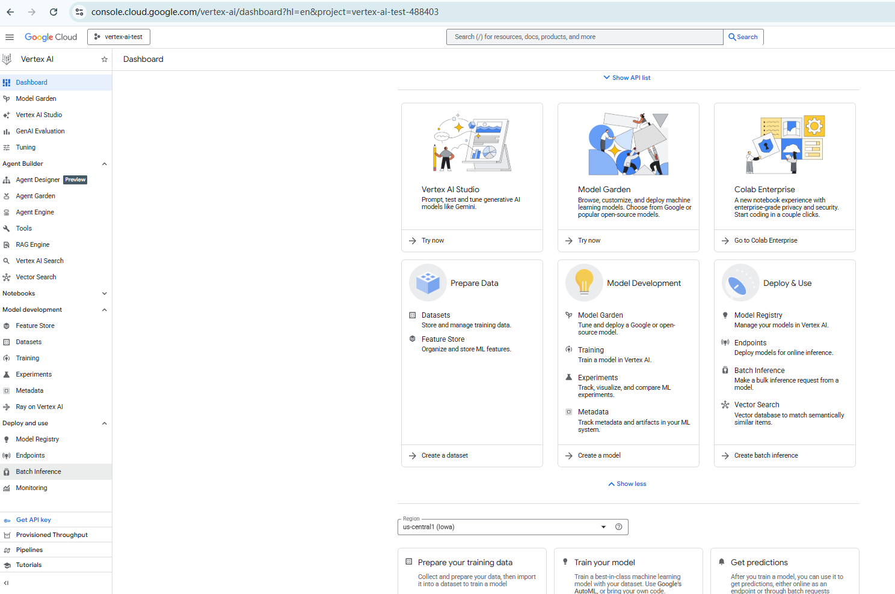

# Referece
- [免费 Google Cloud 功能和试用优](https://docs.cloud.google.com/free/docs/free-cloud-features?hl=zh-cn#free-trial)
-  [Try Gemini Enterprise – Business edition at no cost for 30 days](https://cloud.google.com/free?hl=en). 
- [Cost of building and deploying AI models in Vertex AI](https://cloud.google.com/vertex-ai/generative-ai/pricing#openai-models)


## courses
- [building-live-voice-agents-with-googles-adk](https://learn.deeplearning.ai/courses/building-live-voice-agents-with-googles-adk/lesson/dewdno61/introduction)
- [gemini-cli-code-and-create-with-an-open-source-agent](https://learn.deeplearning.ai/courses/gemini-cli-code-and-create-with-an-open-source-agent/lesson/wrg8ewb6/introduction)
- [AI Guide for Cloud Developers](https://www.youtube.com/watch?v=YfiLUpNejpE&list=PLIivdWyY5sqJio2yeg1dlfILOUO2FoFRx&t=109s)


# 1. Google  AI Products Introduction

- [Generative AI beginner's guide](https://docs.cloud.google.com/vertex-ai/generative-ai/docs/learn/overview?hl=en)


1. [Gemini App](https://gemini.google.com/app)


2. [gemini-api](https://ai.google.dev/gemini-api/docs?hl=en)



Language support and installation
- Library: google-genai
- GitHub Repository: googleapis/python-genai
- Installation: pip install google-genai

3. [Gemini for Google Workspace](https://workspace.google.com/ai)
4. [Gemini for Google Cloud](https://cloud.google.com/gemini)
  
5. [Google for Developers](https://ai.google.dev/gemini-api/docs?hl=en)
  for indenpendent developers

6. [Vertex AI](https://cloud.google.com/vertex-ai)

7. Gemini for Coding 
   - Gemini CLI (vs Claude CLI)
   - Antigravity (vs Claude Code)
  
Now powered by Antigravity, build full-stack apps with multiplayer support, polished UI, and secure connections to real-world services.


# 2. Vertex AI Introduction
- [vertex-ai-platform](https://cloud.google.com/vertex-ai?hl=en)
- [Vertex AI documentation](https://docs.cloud.google.com/vertex-ai/docs?hl=en)
- [生成式 AI](https://docs.cloud.google.com/docs/generative-ai?hl=zh-cn)


Vertex AI is a fully-managed, unified AI development platform for building and using generative AI. Access and utilize Vertex AI Studio, Agent Builder, and 200+ foundation models.

## 2.1  Key capabilities of Vertex AI

- [Key capabilities of Vertex AI](https://docs.cloud.google.com/vertex-ai/docs/start/introduction-unified-platform?hl=en)

## 2.2 Vertex AI Interface

- [Vertex AI Interface](https://docs.cloud.google.com/vertex-ai/docs/start/introduction-interfaces?hl=en)
- [Development tools overview](https://docs.cloud.google.com/vertex-ai/docs/general/developer-tools-overview?hl=en)


## 2.3 Vertex AI- Generative Develop Tools

### Google AI Studio
- [Migrate from Google AI Studio to Vertex AI](https://docs.cloud.google.com/vertex-ai/generative-ai/docs/migrate/migrate-google-ai?hl=en)

- [Google AI Studio Playground](https://aistudio.google.com/prompts/new_chat)



### Vertex AI Studio & console
- [Vertex AI Dashboard](https://console.cloud.google.com/vertex-ai/dashboard?hl=en&project=vertex-ai-test-488403)

- [Vertex AI Studio](https://cloud.google.com/generative-ai-studio?hl=en)

- [Vertex AI Studio in Cloud Console](https://console.cloud.google.com/vertex-ai/studio/multimodal?hl=en&project=vertex-ai-test-488403)


- [Vertex AI Studio-workflow](https://docs.cloud.google.com/vertex-ai/generative-ai/docs/learn/overview?hl=en)


# 3. Vertex AI Agent Builder
- [Vertex AI Agent Builder](https://cloud.google.com/products/agent-builder?hl=en)
- [Vertex AI Agent Builder documentation](https://docs.cloud.google.com/agent-builder/overview?hl=en)


This is the high-level orchestration suite. It includes the Agent Designer, a low-code visual environment for rapid prototyping, and the Agent Garden, a repository of pre-built templates and specialized agents (like customer service or data analysts) that can be deployed instantly.

## Build

### Agent Development Kit (ADK)
- [Agent Development Kit (ADK) documents](https://google.github.io/adk-docs/)
Agent Development Kit (ADK) is an open-source framework that simplifies the process of building sophisticated multi-agent systems while maintaining precise control over agent behavior.

### Agent Garden (Supported in preview)
a library in the Google Cloud console where you can find and explore sample agents and tools that are designed to accelerate your development. In the Agent Garden, you can find the following:

### Agent Designer (Preview)
a low-code visual designer that lets you design and test your agent. Experiment with your agent in Agent Designer before transitioning development to code using Agent Development Kit.

#### Tooling & MCP ：The Connectivity Layer:

## Scale
### Agent Engine： Deployment & MLOps
- [Agent Engine documents](https://docs.cloud.google.com/agent-builder/agent-engine/overview?hl=en)


Vertex AI Agent Engine is a set of services that enables developers to deploy, manage, and scale AI agents in production. Vertex AI Agent Engine offers services such as a fully-managed runtime, evaluation, Sessions, Memory Bank, and Code Execution. Understand agent behavior with Google Cloud Trace (supporting OpenTelemetry), Cloud Monitoring, and Cloud Logging.

The Agent Engine Dashboard provides granular visibility:
  - Trace Visualization: View the "inner monologue" and tool-call sequence of an agent's reasoning.

  - Performance Metrics: Real-time tracking of token usage, latency, and success rates for tool calls.

  - Threat Detection: Integration with Security Command Center to flag if an agent starts exhibiting "suspicious" behavior, like attempting to exfiltrate data.

### Deployment
- [Deploy an agent](https://google.github.io/adk-docs/deploy/)


### Evaluation
- [evaluation-overview](https://docs.cloud.google.com/vertex-ai/generative-ai/docs/models/evaluation-overview?hl=en)

### Observability: 
- Cloud Logging： logging
- Google Cloud Trace: Trace
- Cloud Monitoring： Monitoring 


## Governance
Monitor what your agents are doing with an audit trail for end-to-end observability.

### Agent Engine Threat Detection (Preview)：Detect threats with Security Command Center: 
a built-in service of Security Command Center that helps you detect and investigate potential attacks on agents that are deployed to Vertex AI Agent Engine Runtime.


### Agent identity (Preview):
 Use Identity Access Management (IAM) agent identity to provide security and access management features when using agents on Vertex AI Agent Engine Runtime.

Agent Identities: Each agent now has its own Cloud IAM principal. This ensures "least-privilege" access—an agent can only access the specific buckets or APIs it needs to do its job.

  **Agent IAM** (Identity & Access Management): The framework must support unique service identities for agents. You shouldn't use a master "Admin" key; the agent should have "least-privilege" access to only the specific databases it needs.


# 4. Vertex AI Qucikstart
- check the free trial on [vertex-ai](https://cloud.google.com/vertex-ai?hl=en)
- [Generative AI beginner's guide](https://docs.cloud.google.com/vertex-ai/generative-ai/docs/learn/overview?hl=en)
- [Vertex AI quickstart](https://docs.cloud.google.com/vertex-ai/generative-ai/docs/start?hl=en)

## 1. Requirements
- Have a valid @gmail.com Google Account and Google Cloud project
- Enable billing
- Enable the Vertex AI API in the console
- Have set up a method of authentication, either:
  - Application default credentials (ADC), or
  - An [API key](https://docs.cloud.google.com/vertex-ai/generative-ai/docs/start/api-keys) that's bound to a service account
    [vertex-ai-test API keys](https://console.cloud.google.com/vertex-ai/studio/settings/api-keys?hl=en&project=vertex-ai-test-488403)


## 2.  Configure your project
- In the Google Cloud console, on the project selector page, select or create a Google Cloud project.
- Verify that billing is enabled for your Google Cloud project.
- Enable the Vertex AI API.
- [Install the Google Cloud CLI](https://docs.cloud.google.com/sdk/docs/install-sdk?hl=en)
  install with  [the "Offline" ZIP Archive](https://docs.cloud.google.com/sdk/docs/downloads-versioned-archives?hl=zh-cn)

```bash
$ gcloud --version
Google Cloud SDK 558.0.0
bq 2.1.28
core 2026.02.20
gcloud-crc32c 1.0.0
gsutil 5.35


#  To initialize the gcloud CLI, run the following command:
$ gcloud init
Welcome! This command will take you through the configuration of gcloud.

Your current configuration has been set to: [default]

You can skip diagnostics next time by using the following flag:
  gcloud init --skip-diagnostics

Network diagnostic detects and fixes local network connection issues.
Checking network connection...done.
Reachability Check passed.
Network diagnostic passed (1/1 checks passed).

You must sign in to continue. Would you like to sign in (selecting "Y" will open your browser to the sign-in page where you complete authentication) (Y/n)?  y

Your browser has been opened to visit:

    https://accounts.google.com/o/oauth2/auth?response_type=code&client_id=32555940559.apps.googleusercontent.com&redirect_uri=http%3A%2F%2Flocalhost%3A8085%2F&scope=openid+https%3A%2F%2Fwww.googleapis.com%2Fauth%2Fuserinfo.email+https%3A%2F%2Fwww.googleapis.com%2Fauth%2Fcloud-platform+https%3A%2F%2Fwww.googleapis.com%2Fauth%2Fappengine.admin+https%3A%2F%2Fwww.googleapis.com%2Fauth%2Fsqlservice.login+https%3A%2F%2Fwww.googleapis.com%2Fauth%2Fcompute+https%3A%2F%2Fwww.googleapis.com%2Fauth%2Faccounts.reauth&state=2SCqLTCLPDn1IkjSbp7jP5AvsEX6wN&access_type=offline&code_challenge=skkYenja3viQdz8sXBxI-z-am7E7TZR85vd47xwoFas&code_challenge_method=S256

You are signed in as: [wang***@gmail.com].

Pick cloud project to use: 
 [1] cool-eye-269214
 [2] gen-lang-client-0388215430
 [3] gothic-citizen-81j33
 [4] vertex-ai-test-488403
 [5] Enter a project ID
 [6] Create a new project
Please enter numeric choice or text value (must exactly match list item):  4

Your current project has been set to: [vertex-ai-test-488403].

Not setting default zone/region (this feature makes it easier to use
[gcloud compute] by setting an appropriate default value for the
--zone and --region flag).
See https://cloud.google.com/compute/docs/gcloud-compute section on how to set
default compute region and zone manually. If you would like [gcloud init] to be
able to do this for you the next time you run it, make sure the
Compute Engine API is enabled for your project on the
https://console.developers.google.com/apis page.

Error creating a default .boto configuration file. Please run [gsutil config -n] if you would like to create this file.
The Google Cloud CLI is configured and ready to use!

* Commands that require authentication will use wangfeicheng007@gmail.com by default
* Commands will reference project `vertex-ai-test-488403` by default
Run `gcloud help config` to learn how to change individual settings

This gcloud configuration is called [default]. You can create additional configurations if you work with multiple accounts and/or projects.
Run `gcloud topic configurations` to learn more.

Some things to try next:

* Run `gcloud --help` to see the Cloud Platform services you can interact with. And run `gcloud help COMMAND` to get help on any gcloud command.
* Run `gcloud topic --help` to learn about advanced features of the CLI like arg files and output formatting
* Run `gcloud cheat-sheet` to see a roster of go-to `gcloud` commands.

```
- If you're using an external identity provider (IdP), you must first sign in to the gcloud CLI with your federated identity.


## 3. Create local authentication credentials
Create local authentication credentials for your user account:

```bash
$ gcloud auth application-default login
Your browser has been opened to visit:

    https://accounts.google.com/o/oauth2/auth?response_type=code&client_id=764086051850-6qr4p6gpi6hn506pt8ejuq83di341hur.apps.googleusercontent.com&redirect_uri=http%3A%2F%2Flocalhost%3A8085%2F&scope=openid+https%3A%2F%2Fwww.googleapis.com%2Fauth%2Fuserinfo.email+https%3A%2F%2Fwww.googleapis.com%2Fauth%2Fcloud-platform+https%3A%2F%2Fwww.googleapis.com%2Fauth%2Fsqlservice.login&state=YhlU52M4mIuCWKAFh1whW7zUs2FMBK&access_type=offline&code_challenge=tEBqhBUKOKr5iYBZg2wqyM_uNyvJEXqmoe0iMqds_Pw&code_challenge_method=S256


Credentials saved to file: [C:\Users\michael\AppData\Roaming\gcloud\application_default_credentials.json]

These credentials will be used by any library that requests Application Default Credentials (ADC).

Quota project "vertex-ai-test-488403" was added to ADC which can be used by Google client libraries for billing and quota. Note that some services may still bill the project owning the resource.
```

## 4. Set up required roles

If you're using a standard API key or ADC, your project also needs to be granted the appropriate Identity and Access Management permissions for Vertex AI. If you're using an express mode API key, you can skip to the next step.

To get the permissions that you need to use Vertex AI, ask your administrator to grant you the Vertex AI User (roles/aiplatform.user) IAM role on your project. For more information about granting roles, see Manage access to projects, folders, and organizations.

You might also be able to get the required permissions through custom roles or other predefined roles.


## 5. Using Google Gen AI SDK

#### Install the Google Gen AI SDK and set up your environment
- https://docs.cloud.google.com/vertex-ai/generative-ai/docs/sdks/overview?hl=en
- [Vertex AI quickstart](https://docs.cloud.google.com/vertex-ai/generative-ai/docs/start?usertype=apikey#rest_1)

```bash

pip install --upgrade google-genai
```

Set environment variables:

```bash
# Replace the `GOOGLE_CLOUD_PROJECT_ID` and `GOOGLE_CLOUD_LOCATION` values
# with appropriate values for your project.
GOOGLE_CLOUD_PROJECT_ID="vertex-ai-test-488403"

export GOOGLE_CLOUD_PROJECT=$GOOGLE_CLOUD_PROJECT_ID
export GOOGLE_CLOUD_LOCATION=global
export GOOGLE_GENAI_USE_VERTEXAI=True

echo $GOOGLE_CLOUD_PROJECT

```


####  Make your first request

```python
# run_google_genai_skd.py 
from google import genai
from google.genai.types import HttpOptions

client = genai.Client(http_options=HttpOptions(api_version="v1"))
response = client.models.generate_content(
    model="gemini-2.5-flash",
    contents="How does AI work?",
)
print(response.text)
# Example response:
# Okay, let's break down how AI works. It's a broad field, so I'll focus on the ...
#
# Here's a simplified overview:
# ...

```
#### run the script

```bash
$ python run_google_genai_skd.py 
At its core, Artificial Intelligence (AI) aims to **simulate human intelligence** through machines, enabling them to learn, reason, problem-solve, perceive, and understand language.

The most common and effective way modern AI works is through **Machine Learning (ML)**, a subset of AI. Instead of being explicitly programmed with every rule, AI systems are *trained* on vast amounts of data to identify patterns and make predictions or decisions.

Here's a breakdown of how AI, particularly through Machine Learning, generally works:

### 1. Data Collection & Preparation (The Fuel)

*   **The Foundation:** AI systems need data – lots of it! This data can be text, images, audio, video, sensor readings, numbers, etc.
*   **Quality Over Quantity (but both are good):** The better the quality, relevance, and diversity of the data, the better the AI will perform. "Garbage in, garbage out" is a common adage in AI.
*   **Cleaning & Formatting:** Raw data is often messy. It needs to be cleaned, formatted, labeled, and prepared so the AI can understand and use it effectively. For example, for an AI to recognize cats, you'd feed it thousands of images labeled "cat" and "not cat."

### 2. Choosing an Algorithm/Model (The Brain's Structure)

*   **Algorithms are Recipes:** AI uses various algorithms (mathematical instructions) to learn from the data. Different tasks require different algorithms.
*   **Types of Learning:**
    *   **Supervised Learning:** Most common. The AI learns from *labeled* data (input and corresponding correct output). Example: Showing pictures of cats with the label "cat" and pictures of dogs with the label "dog" to learn to distinguish them.
    *   **Unsupervised Learning:** The AI finds patterns or structures in *unlabeled* data without explicit guidance. Example: Grouping similar customers together for market segmentation.
    *   **Reinforcement Learning:** The AI learns by trial and error, receiving rewards for good actions and penalties for bad ones, aiming to maximize its cumulative reward. Example: An AI learning to play a game by being rewarded for scoring points.
*   **Models are the Brain:** An "AI model" is the specific algorithm, trained and configured for a particular task. Think of it as the "brain" that has learned to perform a function.

### 3. Training the Model (The Learning Process)

This is where the "intelligence" is developed:

1.  **Input:** The prepared data is fed into the chosen algorithm.
2.  **Prediction/Guess:** The algorithm makes an initial "guess" or prediction based on what it's seen so far.
3.  **Error Calculation:** For supervised learning, this guess is compared to the *actual* correct output (the label). The difference is the "error" or "loss."
4.  **Parameter Adjustment (Learning):** Based on the error, the algorithm adjusts its internal parameters (called "weights" and "biases" in neural networks). This is the "learning" part – the algorithm fine-tunes itself to reduce the error in future predictions.
5.  **Iteration:** Steps 1-4 are repeated thousands, millions, or even billions of times with different subsets of the data. Over time, the model gets progressively better at making accurate predictions or decisions.

### 4. Evaluation (Testing the Knowledge)

*   Once trained, the model is tested on a separate set of data it has *never seen before*. This helps to ensure it can generalize its learning to new, real-world scenarios and isn't just memorizing the training data.

### 5. Inference/Prediction (Putting Knowledge to Use)

*   After successful training and evaluation, the AI model is deployed. Now, when it receives new, unseen input data, it can apply its learned patterns and make predictions, classifications, or decisions based on its training.

---

### Key Components of Modern AI:

*   **Data:** The raw material for learning.
*   **Algorithms/Models:** The mathematical instructions and structures that enable learning.
*   **Computational Power:** Powerful processors (especially GPUs) are crucial for handling vast datasets and complex calculations during training.
*   **Domain Expertise:** Human input is often needed to define the problem, prepare data, and interpret results.

### A Simple Analogy: Teaching a Child to Recognize a Cat

1.  **Data Collection:** You show a child many pictures, some of cats, some of dogs, birds, etc.
2.  **Labeling:** For each cat picture, you say "That's a cat." For a dog, you say "That's a dog."
3.  **Learning:** The child starts to observe features: pointy ears, whiskers, specific eye shape, fur patterns.
4.  **Error Correction:** If the child points at a dog and says "cat," you correct them, saying "No, that's a dog." They adjust their internal "rules."
5.  **Refinement:** After seeing thousands of examples and receiving corrections, the child gets very good at distinguishing cats from other animals.
6.  **Prediction:** Later, when they see a new animal they've never encountered, they can confidently say "That's a cat!" based on their learned understanding.

Modern AI, especially Deep Learning (a sophisticated form of ML using neural networks with many layers), extends this concept to incredibly complex patterns and massive datasets, leading to breakthroughs in areas like image recognition, natural language processing, and autonomous systems.        
(py311)

```


## 6. Using Vertex AI SDK(client libraries)
- [Generate content with the Gemini API in Vertex AI](https://docs.cloud.google.com/vertex-ai/generative-ai/docs/model-reference/inference?hl=en&_gl=1*1yvklp5*_ga*OTk2MzQ1MjczLjE3NzA2MjA0NDI.*_ga_WH2QY8WWF5*czE3NzE5OTg3MTAkbzEwJGcxJHQxNzcyMDA5MTQxJGozNCRsMCRoMA..)
- [Vertex AI client libraries](https://docs.cloud.google.com/vertex-ai/generative-ai/docs/reference/libraries?hl=en#client-libraries-install-python)

#### 1.  Install the client library

`pip install google-cloud-aiplatform`
#### 2. Set up authentication

#### 2. Create a Python script
```python
import vertexai
from vertexai.preview.prompts import Prompt

# Initialize vertexai
vertexai.init(project=PROJECT_ID, location="us-central1")

variables = [
    {"animal": "Eagles", "activity": "eat berries"},
    {"animal": "Coyotes", "activity": "jump"},
    {"animal": "Squirrels", "activity": "fly"}
]

# define prompt template
prompt = Prompt(
    prompt_data="Do {animal} {activity}?",
    model_name="gemini-2.0-flash-001",
    variables=variables,
    system_instruction="You are a helpful zoologist"
    # generation_config=generation_config, # Optional
    # safety_settings=safety_settings, # Optional
)

# Generates content using the assembled prompt.
responses = []
for variable_set in prompt.variables:
    response = prompt.generate_content(
        contents=prompt.assemble_contents(**variable_set)
    )
    responses.append(response)

for response in responses:
    print(response.text, end="")

# Example response
    # Assembled prompt replacing: 1 instances of variable animal, 1 instances of variable activity
    # Eagles are primarily carnivorous.  While they might *accidentally* ingest a berry......
```


## 7. (Optional)Test Vertex API Key with curl

1. [create API key for project](https://console.cloud.google.com/vertex-ai/studio/settings/api-keys?chat=true&hl=en&project=vertex-ai-test-488403)

2. make request with curl
```bash

# curl -v -x http://127.0.0.1:7897 http://example.com

export http_proxy="http://127.0.0.1:7897"
export https_proxy="http://127.0.0.1:7897"
curl -v https://google.com
# HTTP/1.1 200 Connection established


API_KEY="AQ.***"
echo $API_KEY

curl "https://aiplatform.googleapis.com/v1/publishers/google/models/gemini-2.5-flash-lite:streamGenerateContent?key=${API_KEY}" \
-X POST \
-H "Content-Type: application/json" \
-d '{
  "contents": [
    {
      "role": "user",
      "parts": [
        {
          "text": "Explain how AI works in a few words"
        }
      ]
    }
  ]
}'


```

error:

```

[{
  "error": {
    "code": 404,
    "message": "Publisher Model `projects/995393065804/locations/asia-southeast1/publishers/google/models/gemini-2.5-flash-lite` was not found or your project does not have access to it. Please ensure you are using a valid model version. For more information, see: https://cloud.google.com/vertex-ai/generative-ai/docs/learn/model-versions",
    "status": "NOT_FOUND"
  }
}
]
```

Fixed: when proxy set to USA

```json
[{
  "candidates": [
    {
      "content": {
        "role": "model",
        "parts": [
          {
            "text": "AI"
          }
        ]
      }
    }
  ],
  "usageMetadata": {
    "trafficType": "ON_DEMAND"
  },
  "modelVersion": "gemini-2.5-flash-lite",
  "createTime": "2026-02-25T09:25:14.101842Z",
  "responseId": "-r-eadKbBvyqmecP9-mOMA"
}
,
{
  "candidates": [
    {
      "content": {
        "role": "model",
        "parts": [
          {
            "text": " learns patterns from data to make predictions or decisions."
          }
        ]
      },
      "finishReason": "STOP"
    }
  ],
  "usageMetadata": {
    "promptTokenCount": 8,
    "candidatesTokenCount": 11,
    "totalTokenCount": 19,
    "trafficType": "ON_DEMAND",
    "promptTokensDetails": [
      {
        "modality": "TEXT",
        "tokenCount": 8
      }
    ],
    "candidatesTokensDetails": [
      {
        "modality": "TEXT",
        "tokenCount": 11
      }
    ]
  },
  "modelVersion": "gemini-2.5-flash-lite",
  "createTime": "2026-02-25T09:25:14.101842Z",
  "responseId": "-r-eadKbBvyqmecP9-mOMA"
}
]

```

