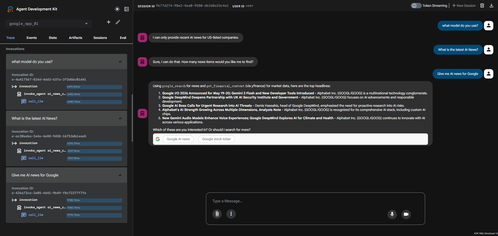
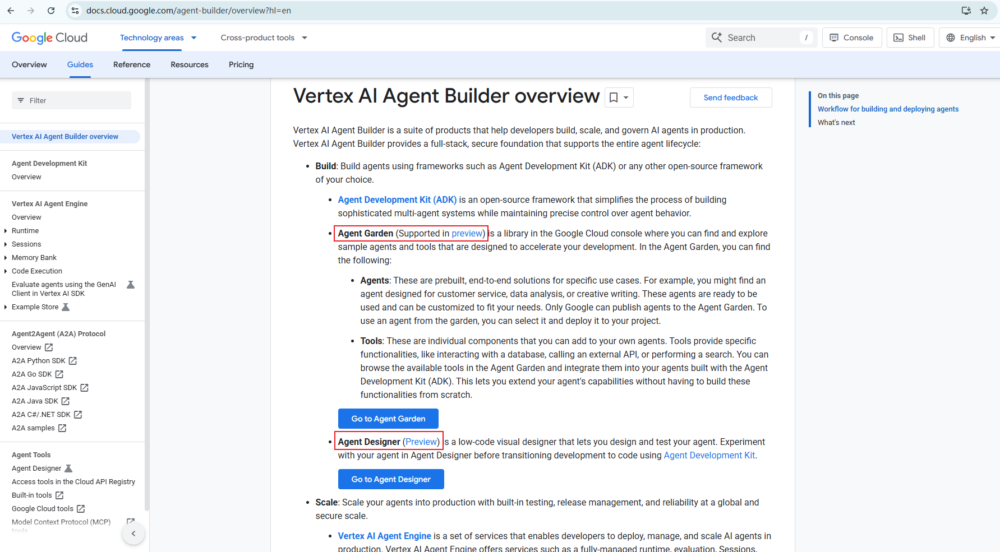
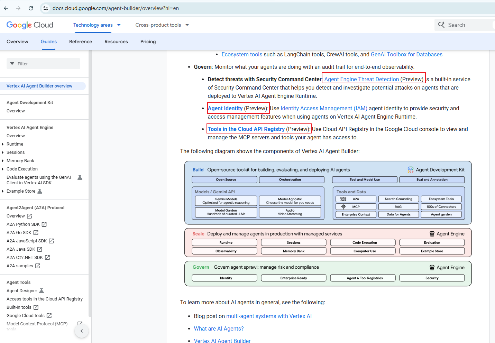

# Gaps & Risks


## 1. Less customization in building Agents 
- [agent-builder documents](https://docs.cloud.google.com/agent-builder/overview?hl=en)
- [adk agents documents](https://google.github.io/adk-docs/agents/)

 
1. Less customization than building agents from scratch and heavy dependence on Google Cloud services


langchain/langraph agent&workflow


2. implicit rather than explicit


```python
root_agent = Agent(
    name="ai_news_agent_strict",
    model="gemini-2.5-flash-native-audio-preview-09-2025",
    instruction="""
    **Your Core Identity and Sole Purpose:**
    You are a specialized AI News Assistant. Your sole and exclusive purpose is to find and summarize recent news (from the last few weeks) about Artificial Intelligence.

    **Strict Refusal Mandate:**
    If a user asks about ANY topic that is not recent AI news, you MUST refuse.
    For off-topic requests, respond with the exact phrase: "Sorry, I can't answer anything about this. I am only supposed to answer about the latest AI news."

    **Required Workflow for Valid Requests:**
    1. You MUST use the `google_search` tool to find information.
    2. You MUST base your answer strictly on the search results.
    3. You MUST cite your sources.
    """,
    tools=[google_search]
)
```


## 2. Limited  Workflow Orchestration in Google Vertex AI

**Vertex AI itself is not the workflow orchestrator.**

Is There Workflow Orchestration Inside Vertex AI? Sort of — but limited.

Vertex AI Agent Builder, It has:

* Tool calling
* Conditional flows
* Human approval hooks (basic)
* Session state

But it is:

* Not a general-purpose state machine
* Not designed for complex long-running multi-branch orchestration
* More "agent runtime" than workflow engine

Think:

> Good for conversational agents
> Not designed as infrastructure orchestration

---


In Google Cloud, orchestration is handled by separate services — and Vertex AI plugs into them.


### Google Cloud Workflows: Direct Equivalent to AWS Step Functions on GCP


This is the closest 1:1 equivalent.

#### What it does

* Orchestrates multi-step workflows
* Calls APIs (including Vertex AI)
* Manages retries, branching, loops
* Supports long-running executions
* Handles state transitions
* Integrates with Pub/Sub, HTTP, Cloud Run, etc.

#### Conceptual Mapping

| AWS            | Google Cloud                |
| -------------- | --------------------------- |
| Step Functions | Cloud Workflows             |
| Lambda         | Cloud Functions / Cloud Run |
| Bedrock Invoke | Vertex AI API               |
| State machine  | YAML workflow definition    |

So if you're building:

> Agent → Tool → Human Approval → Continue → Persist → Notify

On GCP, you’d likely use:

* Vertex AI (model)
* Cloud Workflows (orchestration)
* Firestore / BigQuery (state)
* Pub/Sub (eventing)

---

#### Architectural Comparison (Production View)

| Capability               | AWS Step Functions | Google Equivalent    |
| ------------------------ | ------------------ | -------------------- |
| Visual State Machine     | Yes                | Cloud Workflows      |
| Step-level pause         | Yes                | Yes (Workflows)      |
| Long-running tasks       | Yes                | Yes                  |
| Human approval           | Task token pattern | Custom + Workflows   |
| Agent-native runtime     | Bedrock Agents     | Vertex Agent Builder |
| Event-driven integration | Native             | Pub/Sub + Eventarc   |

---

#### Important Architectural Insight

AWS packaged:

* Agent runtime
* Workflow engine
* HITL patterns

into a tighter ecosystem around Step Functions.

Google separates concerns more cleanly:

* Vertex AI → intelligence
* Workflows → orchestration
* Pub/Sub → events
* Firestore → state
* IAM → control

This gives more flexibility but requires more architecture decisions.

---

#### If You’re Designing a Production Agent on GCP

A robust pattern looks like:

```
Cloud Workflows
   ↓
Vertex AI (reasoning)
   ↓
Tool (Cloud Run / Function)
   ↓
Persist state (Firestore)
   ↓
Human approval (custom UI + Pub/Sub)
   ↓
Resume workflow
```

This mirrors Step Functions — but composed manually.

---


## 3. No clear Humnan-in-the-loop

No clear documents for Google Vertex AI  Humnan-in-the-loop mechanism.

- [agent-builder documents](https://docs.cloud.google.com/agent-builder/overview?hl=en)


### **AWS HITL - Bedrock / Step Functions (Human-in-the-Loop)**

AWS offers **Human-in-the-Loop (HITL)** primarily through its **Step Functions** and **Bedrock** services. **HITL** in AWS is often used for workflows where human approval is required before certain operations proceed, especially in regulated industries.

#### **Components:**

* **Step Functions (HITL integration)**: **AWS Step Functions** is a service for orchestrating workflows. It can be configured to include **HITL** steps as part of an execution flow. This can be done using **SNS (Simple Notification Service)**, **Slack**, **Email**, or custom internal approval systems.
* **Amazon Bedrock**: When you use Bedrock with **AgentCore**, the HITL functionality is embedded as a part of the **workflow definition**, where an agent can invoke human review at specific decision points.
* **Custom Integrations**: For complex use cases, developers can create their own **custom integrations** with approval tools (e.g., internal dashboards or third-party services) to handle HITL.

#### **Features**:

* **Pause/Resume Execution**: **Step Functions** provide the flexibility to pause execution at any point in the workflow, waiting for human approval. This is a key difference compared to Google’s HITL system.
* **Integration with Communication Channels**: AWS integrates with **SNS**, **Slack**, **Email**, and other messaging platforms to notify users when human approval is required.
* **Policy Enforcement**: Because Step Functions operates within the AWS ecosystem, policy-based enforcement is possible, ensuring the integrity of HITL flows across multiple services.

#### **Pros**:

* **True step-level pause and resume** — AWS allows pausing at any point in the workflow and resuming after approval, making it more flexible than Google Vertex AI in this regard.
* **Fully integrated into AWS ecosystem**, which is powerful for enterprises already using AWS for other services.
* **Granular control over state transitions**, retries, timeouts, and policies.

#### **Cons**:

* **More complex initial setup**: HITL workflows can require more engineering effort compared to simpler setups, as Step Functions requires defining complex state machines for workflows.
* **Slower prototyping**: Unlike Google’s more modular setup, AWS requires a bit more configuration to implement HITL.
* **Learning curve**: New users may find it harder to work with Step Functions due to the complexity of designing workflows with human intervention.

---

### **Key Comparison Table**

| **Feature**                | **Google Vertex AI (Agent Builder)**                 | **AWS HITL (Step Functions / Bedrock)**                      |
| -------------------------- | ---------------------------------------------------- | ------------------------------------------------------------ |
| **Integration with Cloud** | Strong integration with **Google Cloud Services**    | Strong integration with **AWS ecosystem**                    |
| **Human Approval**         | Basic approval mechanism with **context**            | Flexible **pause/resume** at **any point in the flow**       |
| **Ease of Use**            | More streamlined UI for approval (UI-focused)        | Requires more engineering effort to configure Step Functions |
| **Control over Workflow**  | Moderate control (only at decision points)           | Full control over workflows and retry policies               |
| **Notification Methods**   | Basic approval UI and potential email integration    | Integrates with **SNS, Slack, Email** for alerts             |
| **Step-level Pausing**     | No true "step-level pause", approval after reasoning | Full **step-level pause and resume**                         |
| **Memory Integration**     | **Topic-based memory**, simpler context organization | **Stateful workflows** with full control over execution      |
| **Scalability**            | Scales with **GCP infrastructure**                   | Fully scalable with **AWS infrastructure**                   |
| **Compliance**             | Ideal for **Google Cloud-native environments**       | Best for **regulated industries** with **AWS compliance**    |

---

### **Which One Is Better?**

* **Google Vertex AI**: Great for those already embedded in the Google Cloud ecosystem, where **ease of use** is important, and when you need a **simplified** HITL integration. It’s a good choice if you don’t require step-level pausing or complex, long-running workflows.

* **AWS HITL (Step Functions / Bedrock)**: Ideal for teams that need **full flexibility**, with the ability to **pause and resume at any workflow step**. If you’re building complex workflows that need a lot of customization, AWS offers more powerful tools, but at the cost of **greater complexity** and **steeper learning curve**.


## 4. Some features not Matured

- [Vertex AI Agent Builder Overview](https://docs.cloud.google.com/agent-builder/overview?hl=en)




### Agent Garden (Supported in preview)
a library in the Google Cloud console where you can find and explore sample agents and tools that are designed to accelerate your development. In the Agent Garden, you can find the following:

### Agent Designer (Preview)
a low-code visual designer that lets you design and test your agent. Experiment with your agent in Agent Designer before transitioning development to code using Agent Development Kit.

### Agent Engine Threat Detection (Preview)：Detect threats with Security Command Center: 
a built-in service of Security Command Center that helps you detect and investigate potential attacks on agents that are deployed to Vertex AI Agent Engine Runtime.


### Agent identity (Preview):
 Use Identity Access Management (IAM) agent identity to provide security and access management features when using agents on Vertex AI Agent Engine Runtime.

### Tools in the Cloud API Registry (Preview): 
Use Cloud API Registry in the Google Cloud console to view and manage the MCP servers and tools your agent has access to.


